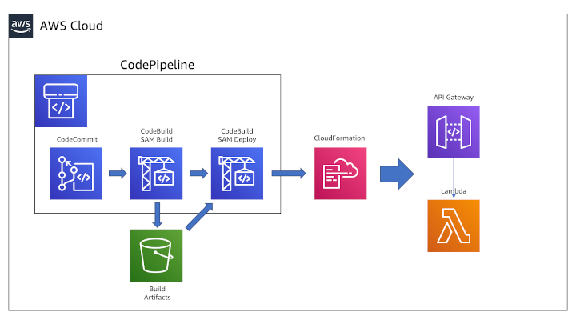

:xrefstyle: short

Deploying this Quick Start for a new virtual private cloud (VPC) with
default parameters builds the following {partner-product-short-name} environment in the
AWS Cloud.

// Replace this example diagram with your own. Follow our wiki guidelines: https://w.amazon.com/bin/view/AWS_Quick_Starts/Process_for_PSAs/#HPrepareyourarchitecturediagram. Upload your source PowerPoint file to the GitHub {deployment name}/docs/images/ directory in this repo. 

[#architecture1]
.Quick Start architecture for {partner-product-short-name} on AWS

As shown in <<architecture1>>, the Quick Start sets up the following:

* A highly available architecture that uses fully-managed AWS services.
* An implementation of a CI/CD pipeline using AWS DevOps services:
** An AWS CodeCommit code repository to host application source code.
** An AWS CodePipeline build orchestration pipeline that automatically triggers a build process when changes are pushed to the code repository.
** A CodePipeline stage that performs the build process of the application code and generation of an AWS CloudFormation template using AWS CodeBuild and AWS SAM.
** A CodePipeline stage that deploys the updated CloudFormation template to AWS using AWS CloudFormation.
* AWS Identity and Access Management roles for the CI/CD pipeline's build and deployment process.
